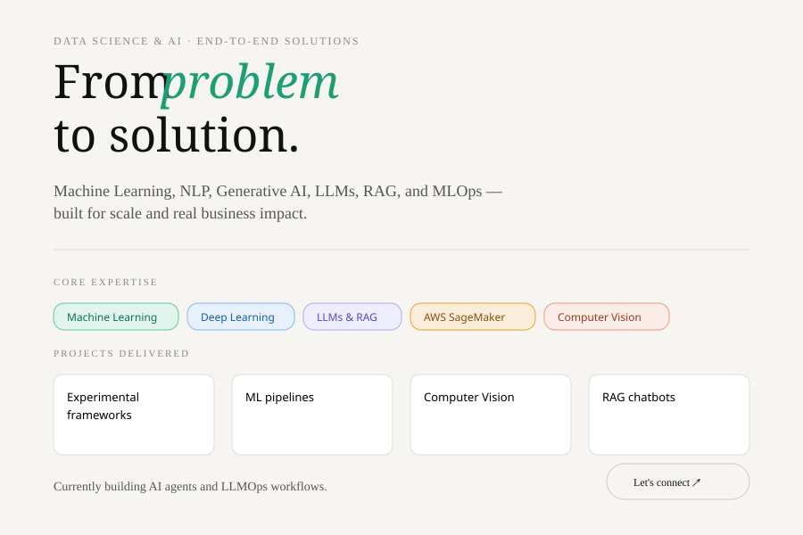

---------------------------------------

--------------------------------------------------------

-----------------------------------------

----------------------------------------------

<h2 align="center"> About Me</h2>

Data Scientist with hands-on experience in machine learning, deep learning, statistical analysis, and 
predictive modeling using Python and SQL. Experienced in data preparation, feature engineering, model 
development, and evaluation to build reliable predictive models. Worked with real client datasets under 
NDA and industry-scale datasets to solve business problems. Currently exploring Generative AI, LLM 
systems, and agentic AI workflows.

---

<h2 align="center"> Skills </h2>

---

  

<!-- Proudly created with GPRM ( https://gprm.itsvg.in ) -->

